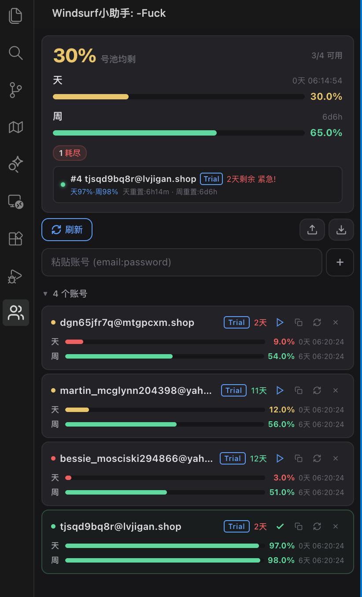

# Windsurf 小助手

无感号池引擎 VSIX 扩展 — 自动管理多 Windsurf 账号，rate limit 前主动切换，零中断。

## 功能特性

- **号池引擎** — 多账号自动轮转，用尽即切，无感切换
- **10 层防御** — 多维度限流检测，从 Context Key 到 gRPC 探测全覆盖
- **设备指纹热重置** — 切号时自动轮转 6 组设备 ID，服务端视为全新设备
- **三重持久化** — 账号数据存 3 个位置，卸载重装不丢失
- **侧边栏仪表盘** — Vue 3 实时展示号池状态、额度、切换记录

## 插件效果



---

## 实现原理

### 1. 认证链 (四步注入)

插件通过逆向 Windsurf 的认证流程，实现账号的自动登录与注入：

```
Step 1: Firebase Auth 登录
        email + password → Firebase REST API → idToken + refreshToken

Step 2: RegisterUser (gRPC)
        idToken → Codeium RegisterUser API → apiKey
        (apiKey 是 Windsurf 所有 API 调用的凭证)

Step 3: 注入 Windsurf Session
        apiKey → 写入 state.vscdb 的 windsurfAuthStatus
        → Windsurf 读取后认为用户已登录，使用新账号的 apiKey 发起请求

Step 4: GetPlanStatus (gRPC + Protobuf)
        idToken → Codeium GetPlanStatus API → 二进制 Protobuf 响应
        → 手写解码器解析 → 获取 credits / quota / plan 信息
```

### 2. 号池引擎运行机制

插件启动后进入自动驾驶模式，核心循环：

```
┌─────────────────────────────────────────────────┐
│                 号池引擎主循环                      │
│                                                   │
│  1. 检测当前账号状态 (10 层防御并行)                  │
│  2. 任一层触发 → shouldSwitch = true               │
│  3. selectOptimal() 选择最优账号                    │
│     ├─ 过滤: 已限流 / 已过期 / 额度耗尽             │
│     ├─ 排序: 剩余额度 > 最近使用时间 > 添加顺序       │
│     └─ 返回: 最优账号 index                        │
│  4. 执行切换                                       │
│     ├─ 轮转设备指纹 (6 组 ID)                       │
│     ├─ 注入新账号 apiKey 到 state.vscdb             │
│     ├─ 清除旧账号缓存 (cachedPlanInfo)              │
│     └─ 触发 Windsurf 重新加载认证状态                │
│  5. 验证注入结果 → 更新状态 → 推送到仪表盘            │
└─────────────────────────────────────────────────┘
```

### 3. 10 层防御体系

多层检测确保在 rate limit 触发**之前**完成切换：

| 层级 | 机制 | 原理 |
|------|------|------|
| L1-L2 | Context Key 轮询 | 每 2 秒读取 VS Code 内部 Context Key，检测 quota 变化 |
| L3 | cachedPlanInfo 监控 | 每 10 秒读取 state.vscdb 中缓存的计划信息，检测额度耗尽 |
| L5 | gRPC 容量探测 | 调用 `CheckUserMessageRateLimit` 接口，获取实时剩余消息数 |
| L6 | 斜率预测 | 基于历史消息速率线性外推，预测何时耗尽 |
| L7 | 速度检测器 | 120 秒窗口内消息速率突变检测 |
| L8 | Opus 预算守卫 | 按模型分级限制: Thinking-1M=1条, Thinking=2条, Regular=3条 |
| L9 | 输出通道拦截 | 实时监控 Windsurf 输出通道，拦截 rate limit 错误信息 |
| L10 | 多窗口协调 | 文件锁 + 心跳机制，多窗口间账号隔离，避免冲突 |

### 4. 设备指纹热重置

Windsurf 通过 6 组设备 ID 识别用户设备，切号时必须轮转以避免服务端关联：

```
storage.serviceMachineId  ← UUID v4 (storage.json + state.vscdb)
telemetry.devDeviceId     ← UUID v4
telemetry.macMachineId    ← UUID v4
telemetry.machineId       ← 32位 hex (无短横)
telemetry.sqmId           ← 32位 hex (无短横)
machineid                 ← UUID v4 (独立文件)
```

热重置流程：生成新 ID → 写入 `storage.json` → 写入 `state.vscdb` → 写入 `machineid` 文件 → Windsurf 重启后自动读取新 ID。

### 5. 数据读写 (state.vscdb)

Windsurf 将内部状态存储在 SQLite 数据库 `state.vscdb` 中，插件通过 Node.js 22.5+ 内置的 `node:sqlite` 模块直接读写：

- **读操作**: 复制 DB 到临时文件 → `DatabaseSync` 以只读模式打开 → 查询 → 关闭删除临时文件 (避免锁冲突)
- **写操作**: `DatabaseSync` 直接打开原始 DB → 设置 `busy_timeout = 5000` (等待 Windsurf 释放锁) → 执行写入 → 关闭
- **事务支持**: 多个写操作可合并为一个事务 (如注入 apiKey + 清除缓存)

### 6. 三重持久化

账号数据写入 3 个独立位置，任一存活即可恢复：

```
P0: <extensionStoragePath>/windsurf-assistant-accounts.json  (扩展存储)
P1: <globalStorage>/windsurf-assistant-accounts.json         (全局存储，卸载扩展后存活)
P2: ~/.wam/accounts-backup.json                              (用户目录，卸载 Windsurf 后存活)
```

启动时自动发现所有位置 → 合并去重 → 以最新数据为准。删除操作同步写入所有位置，防止"复活"。

---

## 架构概览

```
┌─────────────────────────────────────────────────────────┐
│                    Extension Host (Node.js)              │
│                                                          │
│  extension.js ─── 号池引擎 / 12 命令 / 10 层防御          │
│       │                                                  │
│       ├── authService.js ─── Firebase 认证 / Protobuf    │
│       ├── accountManager.js ─── CRUD / 持久化 / 号池聚合  │
│       ├── fingerprintManager.js ─── 6ID 读取/重置/轮转    │
│       ├── sqliteHelper.js ─── state.vscdb 读写           │
│       └── webviewProvider.js ─── 消息路由 / 状态推送       │
│                    │                                     │
│                    │ postMessage                          │
│                    ▼                                     │
│  ┌─────────────────────────────────┐                     │
│  │     Vue 3 Webview (侧边栏)       │                     │
│  │  App.vue → 组件树 → 实时仪表盘    │                     │
│  └─────────────────────────────────┘                     │
└─────────────────────────────────────────────────────────┘
```

## 技术栈

- **语言**: JavaScript (ESM 源码，Vite 构建为 CJS)
- **运行时**: VS Code Extension API (vscode ^1.85.0)
- **前端**: Vue 3 + Vite (Webview 侧边栏)
- **构建**: Vite 双流水线 (webview + extension)
- **数据**: JSON 文件 + node:sqlite DatabaseSync (state.vscdb)
- **网络**: 纯 Node.js https/http/tls，零第三方运行时依赖
- **Protobuf**: 手写编解码器，无 protobuf.js 依赖

## 安装

```bash
npm install        # 安装依赖
npm run package    # 构建 + 打包
npm run install-ext  # 安装到 Windsurf
```

生成的 `.vsix` 在 `output/` 目录。

## 构建命令

| 命令 | 说明 |
|------|------|
| `npm run build` | 双构建 (webview + extension) |
| `npm run build:webview` | 仅 Vue webview → `dist/webview/` |
| `npm run build:ext` | 仅 Extension Host → `dist/extension.js` |
| `npm run package` | 构建 + 打包 → `output/*.vsix` |
| `npm run install-ext` | 打包并安装到 IDE |

## 鸣谢

本项目参考了以下开源项目，在此表示感谢：

- [windsurf-assistant](https://github.com/zhouyoukang/windsurf-assistant) — 核心架构与认证链设计参考

## 许可

MIT
